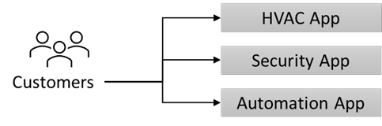

---
casestudy:
    title: 'Fabrikam Residences'
    module: 'Logging and monitoring solutions'
---
# Case Study: Fabrikam Residences

## Requirements

You have taken a new position with Fabrikam Residences, which is very successful and is experiencing rapid growth. Fabrikam Residences is a building contractor for new homes and major home renovations and have become successful by providing quality buildings and offering newer integrated home technologies than their competitors.  

Currently these technologies are provided and managed by separate sub-contract companies. The owners of Fabrikam Residences want to begin offering these upgraded technology options in-house to provide better quality, support and data on customer patterns and needs. 
 
Initially, the company wants to offer HVAC (heating and cooling) control and monitoring, security system monitoring and alerts, and home automation. This will require a new website, data storage solution and data ingestion solution.

The company has seen tremendous growth over the past 2 years. The company is estimating it may double in size over the next 12-18 months. With such rapid growth in the regional market, the company has no current plans to expand outside of the regional market.

## Current Situation

The **Home Technology software** is currently provided and hosted by third parties and involves at least three different websites the customer must visit.  It is proposed the software be replaced with an in-house developed and unified solution.

## Requirements 

**New Home Technology Solution**

- Add a new solution to collect data continuously from the home monitoring sensors.
  - Database some sensor readings for trend analysis and reporting.
  - Provide configurable real-time alerting based on owner needs.
  
- Include a relational database in the solution to hold homeowner preferences and settings.
- System must be scalable.
- Redundancy is critical.
  
- The new unified website will be developed in house and hosted on Linux.  This website will be used to view monitors and change preferences for items such as temperature or alert thresholds. Loads can vary widely, and the system must be able to scale quickly.

-	Provide users a way to sign into the system without creating another user account and password.

## Tasks 

1. Design an architecture for the New Home Technology Solution. Be prepared to explain why you chose each component of the design and how it meets the solution requirements.

